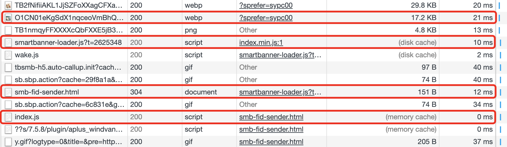

# 浏览器缓存

浏览器缓存其实就是浏览器保存通过 HTTP 获取的所有资源,是浏览器将网络资源存储在本地的一种行为。

## 1 缓存存储的位置

- memory cache 
- disk cache

[https://juejin.im/post/5c4528a6f265da611a4822cc#heading-12](https://juejin.im/post/5c4528a6f265da611a4822cc#heading-12)
