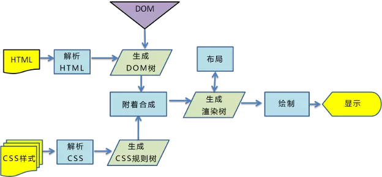
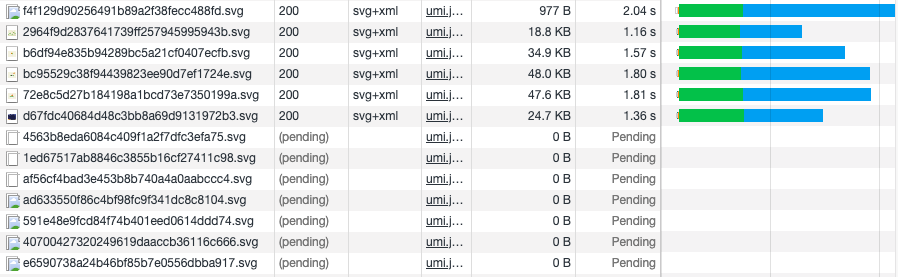
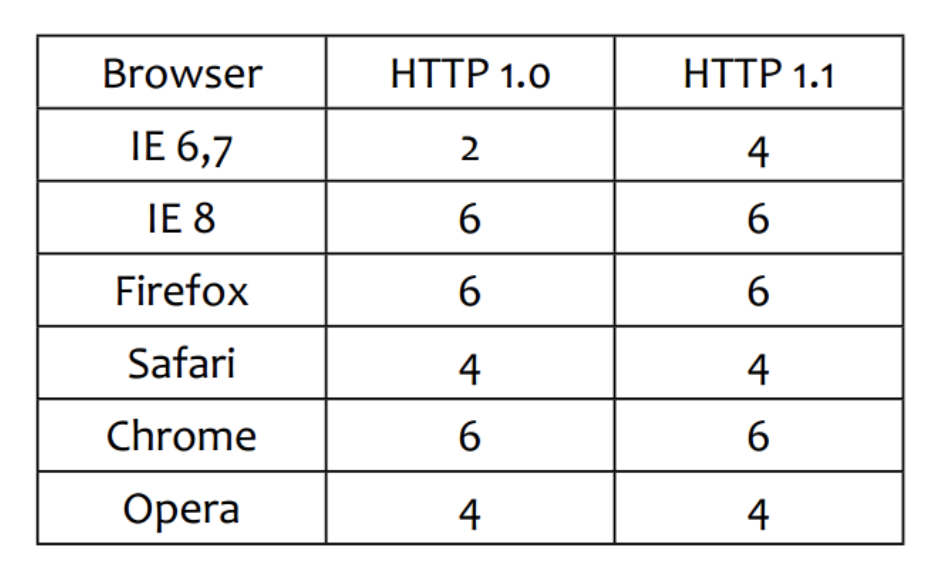
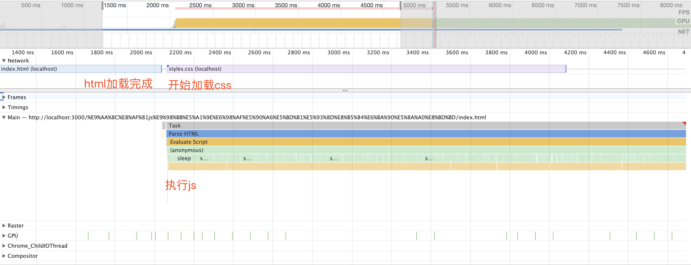
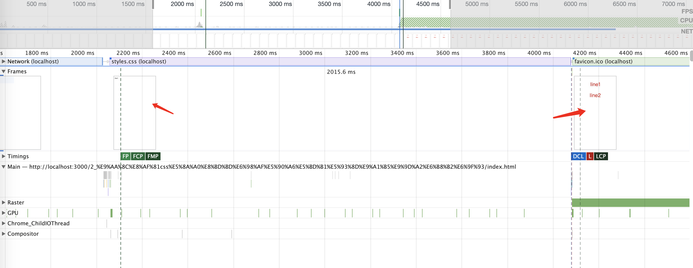

# css 和 js 的装载与执行

## 1 html 页面加载渲染的过程



1. 解析 HTML 生成 DOM 树
2. 解析 CSS 生成 CSSOM 规则树
3. 将 DOM 树与 CSSOM 规则树合并在一起生成渲染树
4. 遍历渲染树开始布局，计算每个节点的位置大小信息
5. 将渲染树每个节点绘制到屏幕

这五个步骤并不一定一次性顺序完成。如果 DOM 或 CSSOM 被修改，以上过程需要重复执行，这样才能计算出哪些像素需要在屏幕上进行重新渲染。实际页面中，CSS 与 JavaScript 往往会多次修改 DOM 和 CSSOM

## 2 资源加载

浏览器是并行加载资源的，但是并发受域名限制，也就是一个域名只能并发加载一定数量的资源。

当 HTML 解析器被脚本阻塞时，解析器虽然会停止构建 DOM，但仍然会识别该脚本后面的资源，并进行预加载。

### 2.1 验证并发加载

如下图，同域名只会同时加载 6 个资源



每个浏览器的并发数可能会不一样（这个图搬运来的，实际情况可能不一致，随着浏览器更新默认值也可能变动），并发数可以设置更改



### 2.2 验证 js 阻塞是否影响资源加载

html 代码如下：

```html
<!DOCTYPE html>
<html lang="zh_CN">
  <head>
    <meta charset="UTF-8" />
    <meta name="viewport" content="width=device-width, initial-scale=1.0" />
    <title>test</title>

    <script>
      function sleep(time) {
        let endTime = new Date().getTime() + time * 1000;

        while (new Date().getTime() < endTime) {}
      }

      sleep(3);
    </script>
  </head>
  <body>
    <div class="text1">line1</div>
    <link href="./styles.css" rel="stylesheet" />
  </body>
</html>
```

在 header 中有一段 js 代码，会阻塞 3 秒钟。



可以看到 js 阻塞不会影响其他资源的加载

## 3 阻塞渲染

### 3.1 验证 CSS 加载是否阻塞页面渲染

默认情况下，CSS 被视为阻塞渲染的资源，这意味着浏览器将不会渲染任何已处理的内容，直至 CSSOM 构建完毕。

CSSOM 构建时，JavaScript 执行将暂停，直至 CSSOM 就绪。

html 中有如下代码，css 放在两个 div 的中间：

```html
<!DOCTYPE html>
<html lang="zh_CN">
  <head>
    <meta charset="UTF-8" />
    <meta name="viewport" content="width=device-width, initial-scale=1.0" />
    <title>验证css加载是否影响页面渲染</title>
  </head>
  <body>
    <div class="text1">line1</div>
    <link href="./styles.css" rel="stylesheet" />
    <div class="text1">line2</div>
  </body>
</html>
```

运行结果如下：



可以看到页面渲染了两次，第一次是在 html 加载完成，css 还未加载完成的时候，这时页面只渲染出了 line1，并且没有样式

第二次渲染是在 css 加载完成后，这时把 line1 line2 都渲染出来了，并且有样式

得出的结论就是：

- 页面渲染不会等待 css js 都加载完成
- css 会阻塞页面的渲染

## 加载和渲染过程的特点

- 顺序执行、并发加载（多个 css、js 文件可以并发加载，但是会顺序执行。并发度受域名限制，也就是一个域名只能并发加载一定数量的资源）
- 是否阻塞（css 加载是否阻塞 js 加载，css 加载是否阻塞 js 的执行，css 加载是否阻塞页面渲染，js 加载是否阻塞 后续 js 执行）
- 依赖关系（页面渲染是否有依赖关系，js 执行是否有依赖关系）
- 引入方式（css、js 的引入方式的特性）

## 顺序执行-并发加载

- 词法分析（词法分析是顺序执行）
- 并发加载
- 并发数量

## css 阻塞与 js 阻塞

- css header 中阻塞页面渲染（css 加载完后才会进行渲染）
- css 阻塞 js 执行（css 加载完之前，后续 js 的执行会被阻塞。js 执行可能需要依赖一些 css 的属性，所以需要被阻塞）
- css 不阻塞外部脚本的加载（阻塞执行，不阻塞加载）

- 直接引入的 js 阻塞页面的渲染（js 可能会操作 dom 或者修改文档结构，不可能一边操作 dom 一边渲染）
- js 不阻塞资源的加载（webkit 会预扫描资源，并且会预加载）
- js 顺序执行，阻塞后续 js 逻辑的执行

## 验证对于某个域名浏览器并发数是有上限的

## 验证 css 加载不会阻塞后面的 js 并发加载

## async、defter

## 动态异步引入 js

## @import、link
